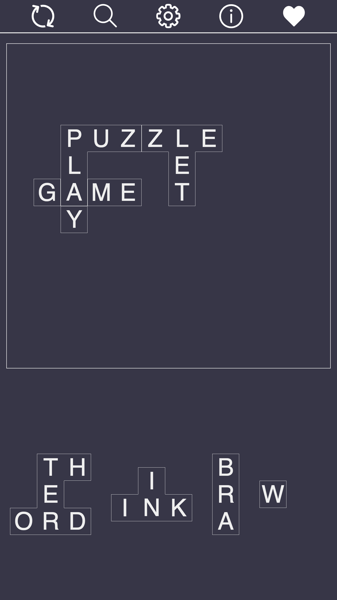

# Crossjig

A word based jigsaw puzzle

**Players:** 1

**Time:** 5 minutes

[Play Now!](https://crossjig.com/)

Do you have feedback or ideas for improvement? [Open an issue](https://github.com/skedwards88/crossjig/issues/new).

Want more games? Visit [SECT Games](https://skedwards88.github.io/).

## Development

To build, run `npm run build`.

To run locally with live reloading and no service worker, run `npm run dev`. (If a service worker was previously registered, you can unregister it in Chrome developer tools: `Application` > `Service workers` > `Unregister`.)

To run locally and register the service worker, run `npm start`.

To deploy, push to `main` or manually trigger the GitHub Actions `deploy.yml` workflow.

Command for compressing the demo video:

`ffmpeg -i src/images/screenshots/demo.mp4 -vf "crop=1440:2944:0:4,scale=300:612" -vcodec libx264 -crf 28 -preset slow -movflags +faststart -an src/images/screenshots/demo-compressed.mp4`

`crop` value was determined with `ffplay src/images/screenshots/demo-compressed.mp4 -vf cropdetect`
